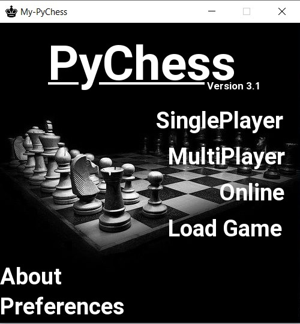
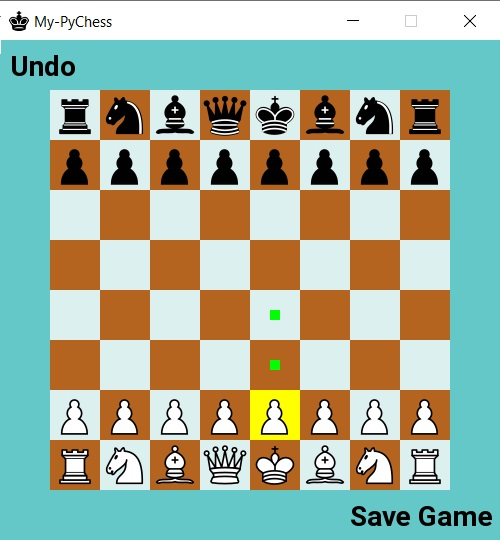
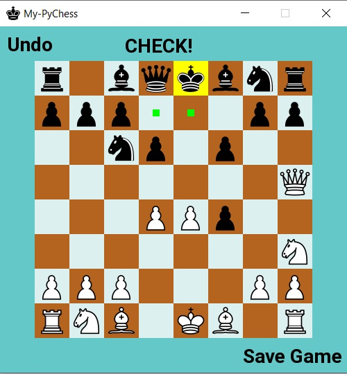
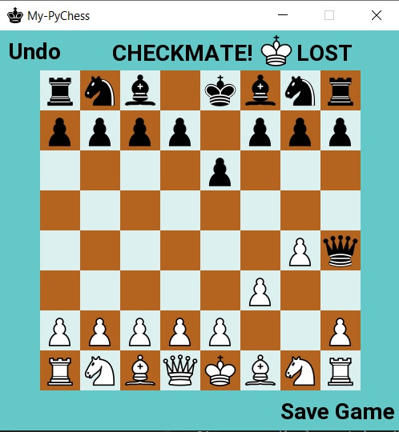
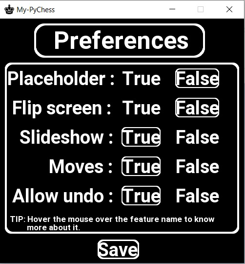
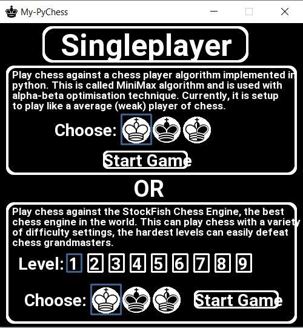
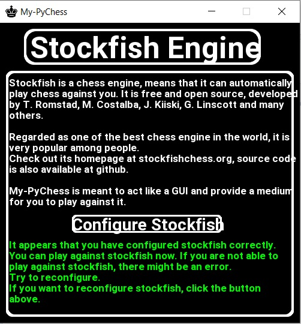
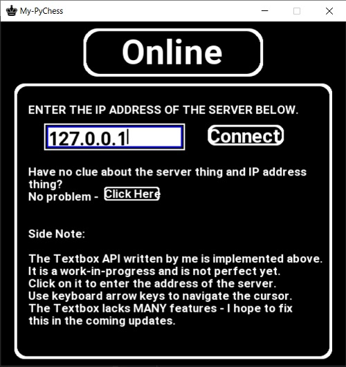
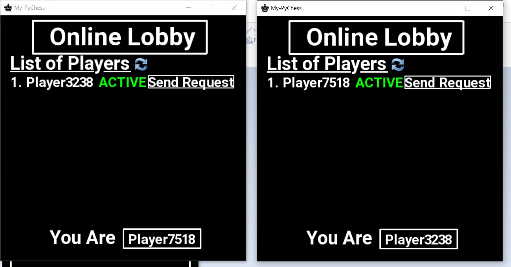

# A few Screenshots of My-PyChess

I have put together a few screenshots of My-PyChess.
Some of those are from older versions of the game.

## This is the Main Menu

## Started a chess match

## Oh Check! Gotta save the king

## Who would do this
 

## I want to customise My-PyChess
 

## I want to load the games I saved
 

## Let's see how good I play against a computer
 

## Gotta configure stockfish to play with it

## Play Chess Online!
 

## This is the Online Lobby
 
